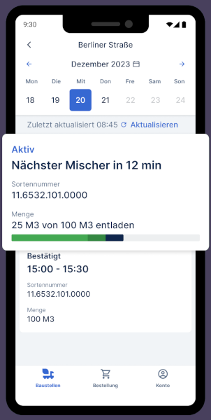

## Contact Information
- **Email**: cv@funktional.dev
- **Address**: Stuttgart, Germany
- **Birthdate**: 8th March 1980
- **Nationality**: German
- **Civil status**: Married

## Professional Summary
Versatile Full-Stack Developer and Software Architect with over 20 years of experience across diverse industries including blockchain, automotive, healthcare technology, fintech, and sustainability. Proven track record in designing and implementing complex software solutions, leading development teams, and driving technological innovation. Proficient in a wide range of technologies and frameworks, with a strong focus on delivering high-quality, scalable applications. Experienced in agile methodologies and team leadership.

## Professional Experience

### Tech Lead, Blockchain Technologies for Daedalus and Lace.io Projects
**Input Output (IOHK)** | Remote | May 2021 - Present

- Initially led a team of 13 professionals in developing the [Daedalus wallet](https://daedaluswallet.io/team)
- Transitioned to lead a smaller, focused team for the [Lace wallet project](https://lace.io)
- Successfully mentored and helped 3 direct reports achieve promotions
- Involved in the technical analysis for the acquisition of Nami wallet

- Led several key initiatives and projects:
  * Spearheaded the creation of multiple proof-of-concepts to add CIP-30 (dapp connection) support on Lace desktop
  * Successfully led the squad that implemented the [multi-delegation feature on Lace](https://www.lace.io/blog/stake-your-ada-across-multiple-pools-with-lace-s-new-multi-delegation-feature-beta)
  * Directed the team responsible for implementing the multi-sig feature on Lace
  * Led the squad that developed the beta version of the dapp-store for Lace, [co-authoring the CIP-72 specification](https://github.com/cardano-foundation/CIPs/tree/master/CIP-0072)
  * Created a prototype using a local LLM to moderate dapp registration by parsing web content and recognizing potentially illegal activities (e.g., selling drugs/weapons, offering pornography without 18+ age verification, etc.)
- Utilized technologies including React, TypeScript, ElectronJs, and Nix/NixOS

### Mobile Application Developer
**HeidelbergCement - HConnect GmbH** | Heidelberg, Germany | Oct 2019 - Dec 2020

* Contributed to the development and support of 'OnSite', a React-Native mobile app used in the construction industry for real-time tracking of cement trucks.

* Implemented features using Redux Thunk, TypeScript, React Query, and Firebase.
* App available globally on iOS and Android:
  * [Google Play Store](https://play.google.com/store/apps/details?id=com.heidelbergcement.rmc.mycrete.us&hl=de)
  * [App Store](https://apps.apple.com/de/app/onsite-by-hconnect/id1394075788)

### Open Source Project: Shitcoin Trader
**Personal Project** | Remote | Feb 2019 - September 2019
- Created an Electron/ReactJS based application for cryptocurrency trading
- Implemented Electron-IPC communication, NeDB, and Redux for state management

### Software Architect & Full-stack Developer
**Freimuth & Graf Consulting UG** | Germany | Apr 2017 - Nov 2018

* Designed the architecture and chose the technology stack (MeteorJS, MongoDB, AWS Lambda, ReactJS, ReactNative/Redux) for an advanced e-Learning platform.
* Led the development team of four as both Software Architect and Scrum Master.
* **NELA App:**
  * Designed and led the development of this E-Learning platform, facilitating communication and language exercise solutions between students and teachers.
  * [Google Play Store](https://play.google.com/store/apps/details?id=academy.nela)
  * [App Store](https://apps.apple.com/de/app/nela-new-language-academy/id1520034158)

### Automotive Javascript Developer
**UID GmbH** | Ludwigsburg, Germany | Dec 2015 - Jun 2016
- Developed a module for Mercedes-Benz vehicles' Head-Unit infotainment system
- Utilized ECMA 5/6 and vanilla Javascript with a custom-designed framework

### Lead Developer & Scrum Master
**Thinkstep AG (formerly PE International)** | Leinfelden-Echterdingen, Germany | May 2014 - Nov 2015
- Led a team of developers and QA specialists in creating cloud-based software for life-cycle assessments (LCA)
- Spearheaded the development of a web application for calculating the LCA of products, generating CO2 footprint charts
- Developed single-page applications using AngularJS and Bower modules
- Implemented RESTful API services using Java Spring MVC
- Served as Scrum Master for a six-person team, facilitating agile development processes
- Wrote unit tests in BDD-Style using Grunt/Karma integrated with Jenkins

### Adobe CQ5 Consultant
**Adobe Systems** | Hirschau, Germany | Feb 2014 - Apr 2014
- Developed e-commerce portal for 'Conrad Electronic SE' using Adobe CQ5
- Integrated webshop with SAP and developed UI using ExtJS-Sencha-Javascript framework

### Co-Founder & Developer
**Bubocloud** | Stuttgart, Germany | Mar 2013 - Jan 2014
- Developed a Lawsuit Case Management system for law firms in the legal tech sector
- Utilized jQuery Mobile, Hibernate, Spring-Core, Spring-Security, and Spring-MVC

### IT Consultant
**Daimler AG** | Stuttgart, Germany | Jan 2011 - Dec 2012
- Designed and implemented templates for Mercedes Benz after-sales portal using CQ4
- Created a custom test framework for automated testing of the Vehicle-Suite Module

### Multi-role IT Consultant
**dmc GmbH (now Diconium)** | Stuttgart, Germany | Mar 2006 - Dec 2010
- Alfresco Software Engineer: Developed and integrated CMS solutions, including OpenCMS integration with Alfresco
- Service Support Engineer: Provided third-level support, bug fixing, and workaround creation
- Technical Project Manager: Managed client relationships, provided technical consulting, and oversaw project financials
- CMS Software Developer: Developed and maintained content management systems, conducted client training
- Q.A. and C++ Software Developer for ICW:
  - Developed a test framework using Visual Studio C++ for an SDK library controlling insurance-card-reader terminals
  - Created software for embedded systems in the healthcare sector, integrating with ICW's cloud-based electronic prescription system
  - Utilized technologies including Java, OSGI, XML-SOAP Web Services, and worked with embedded systems

### Junior PHP Developer
**Sedo GmbH** | Köln, Germany | Jan 2005 - Sep 2005
- Developed PHP applications for visualizing Internet statistics in the domain trading industry

### Junior Java Developer
**Core Systems** | Santiago de Chile | Jun 2003 - Jul 2004
- Implemented Internet banking portal for 'Banco Falabella' using Oracle technologies

## Skills
- Leadership and Mentoring
- Proof-of-Concept Development
- LLM Integration and Application
- Programming Languages: TypeScript, JavaScript (ES6/NodeJS), Java, C++, PHP, Perl, Solidity
- Frontend Frameworks: React, Redux, AngularJS, jQuery, Lodash, D3.js, Electron
- Backend Frameworks: MeteorJS, ExpressJS, Spring (Core, Security, MVC), Hibernate, OSGI
- Mobile Development: React Native, Android SDK
- Databases: MongoDB, MySQL, Oracle, HSQLDB
- Cloud Services: AWS (Lambda, S3, EC2)
- Version Control: Git (Git-Flow), SVN
- Build/Deployment: Docker, Webpack, Yarn/NPM, Grunt, Maven, Ant, Jenkins, Bitbucket Pipelines
- Testing: Jest, Protractor, Karma, Selenium, TestNG, JUnit
- Blockchain: Ethereum, Smart Contracts, Truffle, Web3.js
- Other: RESTful APIs, SOAP, WebSockets, Agile/Scrum
- Team Leadership
- Agile Methodologies: Scrum, Kanban
- Sustainability Software: Life Cycle Assessment (LCA)

## Industry Expertise
- Blockchain: Wallet development (including multi-signature and multi-delegation features), smart contracts, cryptocurrency trading platforms, dapp ecosystems
- Automotive: Infotainment systems, after-sales portals
- Healthcare Technology: Embedded systems for insurance card readers, electronic prescription systems
- Fintech: Internet banking, cryptocurrency trading
- EdTech: E-learning platforms
- Content Management: Enterprise CMS solutions (Alfresco, OpenCMS)
- Sustainability: Life-cycle assessment software, CO2 footprint calculation, environmental impact analysis
- Legal Tech: Case management systems

## Certifications
- Oracle Certified Professional, Java SE 6 Programmer (2012)
- Adobe CQ5.6 Advanced Developer (2013)
- RedHat RHCT (Cert. Number: 609003180807490)

## Education
**INACAP - Universidad Tecnológica de Chile** | Mar 1998 - Sep 2003 |
Bachelor Computer Science

## Languages
- Spanish: Native
- German: Fluent
- English: Fluent

## Additional Training
- Oracle 9i SQL/PLSQL (Oracle University, Santiago de Chile, 2003)
- Ethereum smart contract development (ERC-20 and ERC-721) at Ivan on Tech
